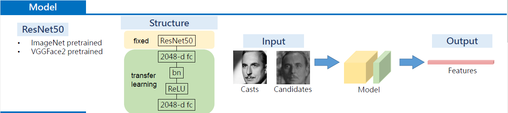
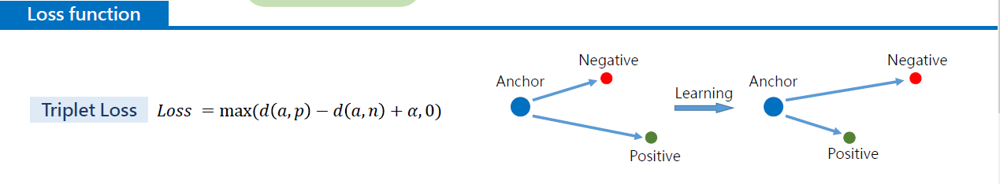
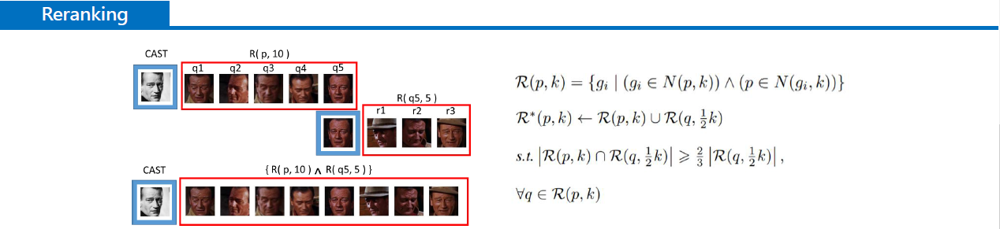
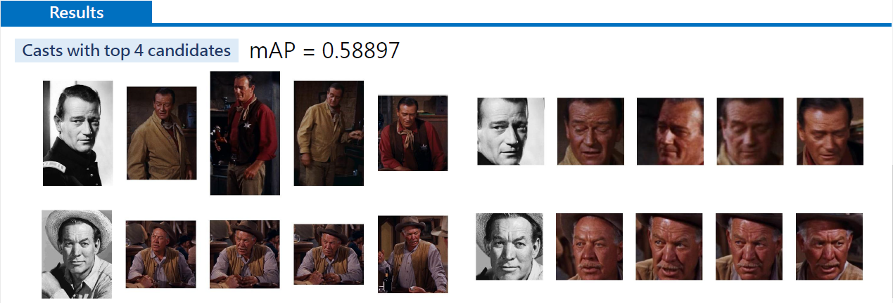

# Final Project - Cast Search by Portrait Challenge
Deep Learning for Computer Vision (107-2) Group 36  

## Task Definition
Given an image of a target query cast and some candidates from gallery, we are requested to search for all the instances belonging to that cast, and sort the result by confidence.

## Solutions and Experiment
1. Best Solution : Considered as Human Re-Identification and Re-Ranking problem, Extracting features to calculate distance between people.
2. Naive Solution : Considered as Classification problem, classifing candidates into different class of people.

## Workflow for our best solution : Human Re-Identification and Re-Ranking
### 1. Dataset Preprocessing : Cropping faces with pre-trained face detection model (reference : [1] face.evoLVe).

  

### 2. Model Design : Resnet50 (pretrained with Imagenet or VGGFace2) with fixed weights, and self-designed further features extracting layers.

  

### 3. Training : With Triplet Loss Function, train the model to be able to distinguish the distance between two features from diffrernt faces.

  

### 4. Inferencing : Extract features of all casts and candidates with trained model, and calculate distance between all casts and candidates with either cosine similarity function or re-ranking function. Output the ranking order as csv format finally.

  

### 5. Validation : When inferencing on validation dataset, we has ground truth to calculate mAP scores to measure accuracy of our model.

  

## Workflow for naive solution
### 1. 
### 2. 
### 3. 

# Usage of codes to reproduce our results
### 0. Cloning the project repository
To start working on this project, clone this repository into your local machine by using the following command.

    git clone https://github.com/dlcv-spring-2019/final-yuchiang_little_fans-list.git

### 1. Downloading Dataset
In the starter code of this repository, we have provided a shell script for downloading and extracting the origin dataset for this project. For Linux users, simply use the following command.

    sh ./get_dataset.sh IMDB
The shell script will automatically download the dataset and store the data in a folder called `IMDB`. Note that this command by default only works on Linux. If you are using other operating systems, you should download the dataset from [this link](https://drive.google.com/drive/folders/1GItzg9wJBiPFrDPBUXQdZgs1ac0Wwbju?usp=sharing
) and unzip the compressed file manually. Remember to put the unzip folder in folder named `IMDB`.

### 2 Dataset preprocess: Face Cropping
Before training, we have cropped the head in the images.  
(1) Cropping by code
Execute the image preprocessing by below command

    python3 ./preprocess/face.evoLVe.PyTorch/align/face_align.py --source_root ./IMDb/train --dest_root ./IMDb_resize/train --crop_size 224

(2) Download Cropped dataset directly
Because cropping dataset is very time consuming, you could download cropped dataset directly from google drive through the following command.

    sh get_resize_data.sh

Shell script has to makedir ./IMDb_resize/ folder, unzip the zip files, and remove the zip files.

### 3. Training
Before starting training, download the pre-trained model first through the following command.

    sh get_res50model.sh

This command would download the pre-trained model to folder `pretrain`.

Then, to reproduce our best model, train the model with the following command.
  
    python3 train.py

### 4. Validation

Please run the code below to validate:

    python inference_csv.py --action val --out_folder ./inference/val

We have a reranking algorithm, which can provide a large improve of mAP. if using cosine similarity only, the maximum mAP is 47.05% in our experiments. By applying the reranking algorithm, we can get maximum about 11% improves on mAP:

|  k1   |  k2   | lambda | mAP with reranking |
| :---: | :---: | :----: | :----------------: |
|  20   |   6   |  0.15  |         x          |
|  20   |  10   |  0.15  |         x          |
|  40   |   6   |  0.15  |         x          |
|  ...  |  ...  |  ...   |        ...         |

### 5. Inferencing

Run the code below to inference:

    python3 inference_csv.py --action test --out_folder ./inference/test

This code will generate a file `rerank.csv` in ./inference/test, please check it an submit to kaggle.

### 6. Visualization

To visualize the sorting result, please run the code:

    python3 visual.py

### Packages
Below is a list of packages you are allowed to import in this assignment:

> [`python`](https://www.python.org/): 3.5+  
> [`torch`](https://pytorch.org/): 1.0  
> [`h5py`](https://www.h5py.org/): 2.9.0  
> [`numpy`](http://www.numpy.org/): 1.16.2  
> [`pandas`](https://pandas.pydata.org/): 0.24.0  
> [`torchvision`](https://pypi.org/project/torchvision/): 0.2.2  
> [`cv2`](https://pypi.org/project/opencv-python/)
> [`matplotlib`](https://matplotlib.org/)
> [`skimage`](https://scikit-image.org/)
> [`Pillow`](https://pillow.readthedocs.io/en/stable/)
> [`scipy`](https://www.scipy.org/)  
> [The Python Standard Library](https://docs.python.org/3/library/)

Note that using packages with different versions will very likely lead to compatibility issues, so make sure that you install the correct version if one is specified above.

### Referrence

1. [Person_reID_baseline_pytorch](https://github.com/layumi/Person_reID_baseline_pytorch)

2. [Re-ranking Person Re-identification with K-reciprocal Encoding](http://openaccess.thecvf.com/content_cvpr_2017/papersZhong_Re-Ranking_Person_Re-Identification_CVPR_2017_paper.pdf)

3. [face.evoLVe: High-Performance Face Recognition Library based on PyTorch](https://github.com/ZhaoJ9014/face.evoLVe.PyTorch)